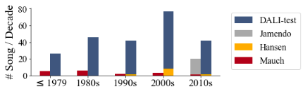

# DALI-TALT

A new polyphonic evaluation set curated for Automatic Lyrics Transcription (ALT) research which was introduced in the paper "MSTRE-Net: Multistreaming Acoustic Modeling for Automatic Lyrics Transcription". 

The statistics of DALI-TALT and other evaluation sets used in ALT research (in English language) are given below (2nd row from top):

.")


The dataset contains 240 songs in English language that are released in various decades and music styles. Below is provided a description of the dataset curation procedure as explained in the paper:

"_We began from the subset presented in Vaglio et al. (1), which initially had 513 recordings and filtered it according to a number of criteria. Numerous audio samples were not retrievable from the links provided. We obtained the Youtube links through automatic search using relevant key words. We discarded songs where the automatically retrieved version was a live performance, had low audio quality or contained extra background speech sections unrelated to its corresponding lyrics. For consistency and fair evaluation, we did not include songs where the dominant language was not English. We allowed for an artist to have at most 5 songs. Among the remaining recordings, we manually selected a subset having a relatively balanced distribution of singers’ gender, official release dates over decades (see Figure below) and variability in terms of singing styles, vocal effects and music genre. Lyrics were initially obtained from the annotations provided in [5] and manually verified following the steps explained in Section 5.1. **The final version of DALI-TALT consists of 240 recordings**._"





In the Jupyter notebook, ```Tutorial_DALI_TestSet4ALT.ipynb```, you will find a tutorial to retrieve the audios in DALI-TALT.


### Installation

To be able to retrieve the audio as in the tutorial, you need to install the python packages in ```requirements.txt```:

```
pip install -r requirements.txt
```


Please cite
```
@article{demirel2021mstre,
  title={MSTRE-Net: Multistreaming Acoustic Modeling for Automatic Lyrics Transcription},
  author={Demirel, Emir and Ahlb{\"a}ck, Sven and Dixon, Simon},
  journal={arXiv preprint arXiv:2108.02625},
  year={2021}
}
``` 
