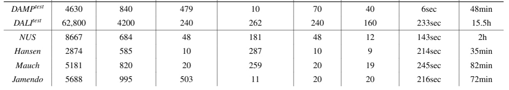

# DALI_TALT

A new polyphonic evaluation set curated for Automatic Lyrics Transcription (ALT) research. The dataset contains 240 songs in English language that are released in various decades and music styles. 

This repository contains a tutorial to retrieve the recordings used in the paper "MSTRE-Net: Multistreaming Acoustic Modeling for Automatic Lyrics Transcription"


<p align="center">
    
</p>


### Installation

To be able to retrieve the audio as in the tutorial, you need to install the python packages in ```requirements.txt```:

```
pip install -r requirements.txt
```


More information will be provided soon...

Please cite
```
@article{demirel2021mstre,
  title={MSTRE-Net: Multistreaming Acoustic Modeling for Automatic Lyrics Transcription},
  author={Demirel, Emir and Ahlb{\"a}ck, Sven and Dixon, Simon},
  journal={arXiv preprint arXiv:2108.02625},
  year={2021}
}
``` 
